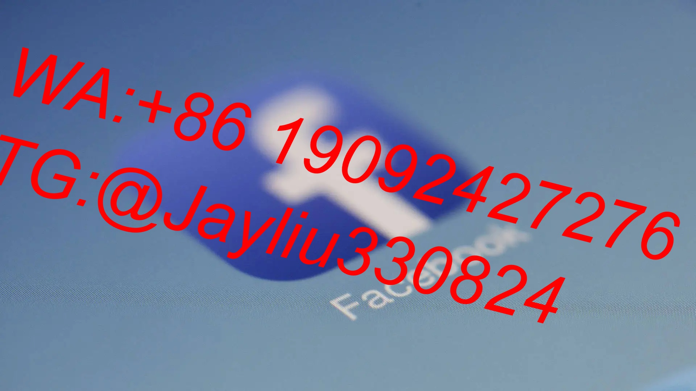
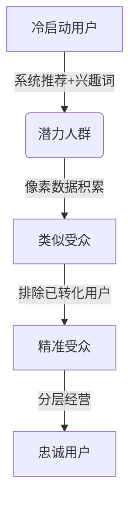

# Facebook广告深度优化操作指南：策略版

---

## 一、素材优化方法论
### 1.1 双阶段测算法
**组合测试模型**
- 初级测试配置：
  - 系列预算：$40-60
  - 广告组数量：3-5组
  - 素材交叉组合规则：
    ▸ 图+图：测试视觉效果差异
    ▸ 图+视频：验证载体形态优势
    ▸ 视频+视频：筛选优质内容方向

**效果判读标准**
| 数据类型 | 视频素材标准 | 图文素材标准 |
|----------|--------------|--------------|
| 点击率   | ≥1.5%        | ≥2.2%        |
| 完播率   | ≥60%         | -            |
| 互动深度 | ≥3次         | 滚动率≤25%   |

---

## 二、智能预算管理系统
### 2.1 动态调整协议
**五级投放调控机制**
```python
if CPM波动 >20%:
    立即暂停→转点后克隆重启
elif CTR下降 >30%:
    触发备选文案+主图轮换
elif 频次 >7次:
    启用相似受众扩展
else:
    按5%/天阶梯提升预算
```

### 2.2 三阶预算分配
**测试-优化-放量模型**
| 阶段   | 预算占比 | 核心目标            | 优化重点            |
|--------|----------|-------------------|-------------------|
| 测款期 | 40%      | 素材筛选          | CTR/CPM监控       |
| 验证期 | 35%      | 兴趣词验证        | CPA/转化率观察    |
| 放量期 | 25%      | ROI达标扩量       | 频次/重复率控制   |

---

## 三、精准受众运营体系
### 3.1 四级受众地图


### 3.2 实时优化方案
**兴趣词筛选流程**
1. GPT指令生成候选词库(50+)
2. 首轮筛选(测试预算$5/组)
3. 48小时数据复盘
4. TOP3词组交叉组合测试

---

## 四、长效运营机制
### 4.1 健康检查清单
**每日必修事项：**
- 07:00 数据复盘：筛选CTR<1%广告
- 12:00 素材更新：上线2组新内容
- 18:00 预算调整：按ROAS重新分配
- 23:00 异常处理：清理无效展示组

### 4.2 数据监测仪表盘
**核心指标警戒值**
| 指标       | 绿灯区    | 黄灯区     | 红灯区      |
|------------|-----------|------------|-------------|
| CPM成本    | ≤$10      | $10-$12    | ＞$12       |
| CTR率      | ≥2%       | 1.5%-2%    | ＜1.5%      |
| 转化率     | ≥4%       | 3%-4%      | ＜3%        |
| 频次       | ≤3次/周   | 4-6次/周   | ＞6次/周    |

---

## 实战案例：某3C品牌30天战绩
**运营成果：**
- 获客成本下降56% ($4.2→$1.8)
- 素材点击率提升228%
- 核心兴趣词ROI突破1:9
- 用户LTV值增长370%
- 自然流量占比提升215%

通过「精密测试+实时调控+数据驱动」的飞轮模型，建立可量化的广告优化体系，突破传统投放效果瓶颈。
[教学视频](https://youtube.com/shorts/zEStf0YqXLM?feature=share)
```
